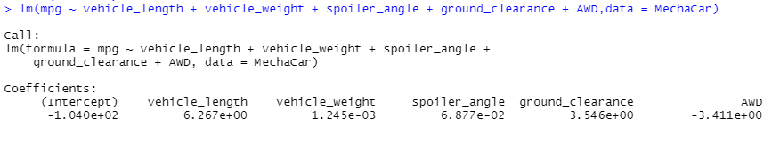
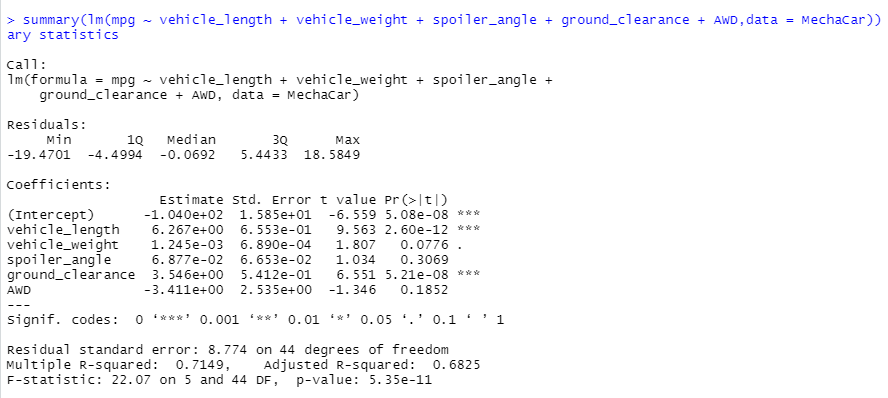
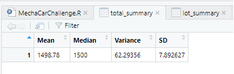
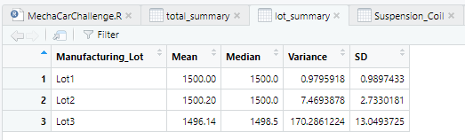
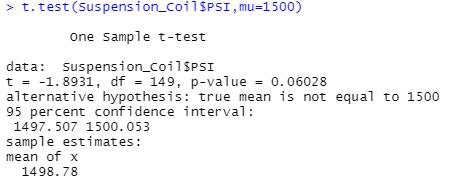

# MechaCar_Statistical_Analysis

## Table of Contents
- [Project Overview](#OverviewProject)
- [Results and Summary](#Results)
  * [Linear Regression to Predict MPG](#LR2MPG)
  * [Summary Statistics on Suspension Coils](#SummStatSC)
  * [T-Test on Suspension Coils](#ttestSC)
  * [Study Design: MechaCar vs Competition](#Study)
- [Summary](#Summary)
- [Resources](#Resources)

## Project Overview

[[1]](#1)
[[2]](#2)
[[3]](#3)

## Results and Summary

### Linear Regression to Predict MPG

[[1]](#1)
[[2]](#2)

  

 Figure 1: Multi Variable Linear Regression Model
 

  

 Figure 2: Summary Statistics on Linear Regression Model
 

### Summary Statistics on Suspension Coils

[[1]](#1)
[[3]](#3)

  

 Figure 3: Suspension Coils PSI Statistics
 

  

 Figure 4: Suspension Coils PSI Statistics per Manufacturing Lot
 

### T-Tests on Suspension Coils

[[1]](#1)
[[3]](#3)

  

 Figure 5: Suspension Coils Sample PSI Mean vs Population Mean (T-Test)
 

  

 Figure 6: Suspension Coils PSI Mean per Manufacturing Lot vs Population Mean (T-Test)
 

### Study Design: MechaCar vs Competition

## Resources

<a name="1">[1]</a> [R Code Used](https://github.com/tamiespinosa/MechaCar_Statistical_Analysis/blob/5f87ef4ad2d6364b9f5d77face1fadabb13255ce/MechaCarChallenge.R)

<a name="2">[2]</a> [MechaCar Data](https://github.com/tamiespinosa/MechaCar_Statistical_Analysis/blob/5f87ef4ad2d6364b9f5d77face1fadabb13255ce/MechaCar_mpg.csv)

<a name="3">[3]</a> [Suspension Coil Data](https://github.com/tamiespinosa/MechaCar_Statistical_Analysis/blob/5f87ef4ad2d6364b9f5d77face1fadabb13255ce/Suspension_Coil.csv)

