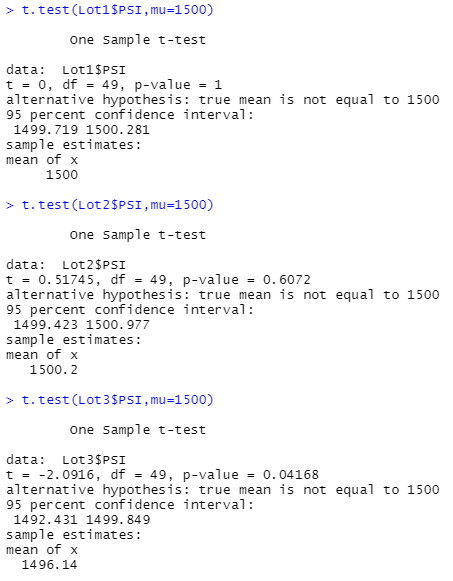

# MechaCar_Statistical_Analysis

## Table of Contents
- [Project Overview](#OverviewProject)
- [Results and Summary](#Results)
  * [Linear Regression to Predict MPG](#LR2MPG)
  * [Summary Statistics on Suspension Coils](#SummStatSC)
  * [T-Test on Suspension Coils](#ttestSC)
  * [Study Design: MechaCar vs Competition](#Study)
- [Summary](#Summary)
- [Resources](#Resources)

## Project Overview

A fictional company, AutosRUS, wanted data analysis performed in theit newest prototype, the MechaCar. We performed a linear regression analysis to see which variables influence the milleage per gallon (MPG) the most. Additionally, we looked into the suspension coils data and check their performance for each manufacturing lot. We used R and R Studio to perform this analysis [[1]](#1), using data for the MechaCar MPG performance and suspension coils data [[2]](#2),[[3]](#3).

Finally we will propose a statistical study to compare the MechaCar against other manufacturers. 

## Results and Summary

### Linear Regression to Predict MPG

#### Results

Using R code [[1]](#1) and the MechaCar Data [[2]](#2) we created a linear regression equation as follows: 

  mpg = 6.267e+00 (vehicle_length) + 1.245e-03(vehicle_weight) + 6.877e-02(spoiler_angle) + 3.546e+00 (ground_clearance) - 3.411e+00(AWD) - 1.040e+02  

  

 Figure 1: Multi Variable Linear Regression Model
 

We used the linear regresson model equation to find a statistical summary  for the model. 

  

 Figure 2: Summary Statistics on Linear Regression Model
 

#### Summary

Using the statistical summary we determined that the variables that provided non random amount of variance were vehicle_length, ground_clearance and the intercept. For these variables the p values were less than our statistical significance level, 0.05, see Figure 2. For the other variables, (vehicle_weight, spoiler_angle, and AWD), we failed to reject that they did not provide variation to the mpg results beyond random chance. Since the intercept proved to be significant, this let us know that either there are other variables not considered that would provide variation to our model or that other variables such as vehicle_weight need scaling or transforming in order to help predict the mpg more. Normally, we would think that the vehicle weight would be a contributing factor to the miles per gallon used by said vehicle, so we tend to think that scaling or transforming would be needed in this case. 

The overall p value for our linear regression model was 5.35e-11, see Figure 2. If our p value was greater than 0.05 we would say that the slope of our model is zero (flat line) or in other words that the independent variables have no significant linear relationship with the mpg results. Yet, since our p value is less than 0.05 we can confirm that the slope is not equal to zero and therefore our independent variables do have a linear relationship the mpg results. 

Overall we can say that our linear regression model does predict the mpg results for the MechaCar prototype. We say this because the r-squared value is 0.7149, meaning that 71.5% of the variability of the mpg variable can be explained with the model created. The closer this value is to 1, the more accurately the model predicts the real data points collected and 0.7149 is closer to 1 than it is to 0. 

### Summary Statistics on Suspension Coils

#### Results

Using R code [[1]](#1) and the suspension coil data [[3]](#3), which includes the vehicle ID, the lot in which it was manufactured and the suspension coils PSI, we found the statistical summary for the suspension coils PSI for all MechaCars built. 

  

 Figure 3: Suspension Coils PSI Statistics
 

Additionally we grouped the vehicles by the lot in which they were manufactured, and then found the summary statistics per lot. 

  

 Figure 4: Suspension Coils PSI Statistics per Manufacturing Lot
 

#### Summary

The manufacturing requirement for suspension coils requires for the variation to stay below 100 psi. When looking at the variation for all samples, see Figure 3, this requirement is met yet the variation seems to be in the higher side. This is better explained when we dig deeper into the performance of the suspension coils per the lot where there were manufactured. Lot 1 and Lot 2 have variances below 8 psi, very small variances. Lot 3 in the other hand exceeds the acceptable variance, with a variance value of 170.3 psi, see Figure 4. This is driving the overall variance value up. Addressing this manufacturing non conformance in Lot 3 would better the overall variance results for all AutoRUS suspension coils. 

### T-Tests on Suspension Coils

#### Results

Following the variance results for suspension coils, we ran a T-Test on the suspension coil data as a whole. We compared it to a fiven population mean of 1,500 PSI. We used R code [[1]](#1) and the suspension coil data [[3]](#3). 

  

 Figure 5: Suspension Coils Sample PSI Mean vs Population Mean (T-Test)
 

Based on the difference in variance for each manufacturing lot, we ran a T-Test for the cars manufactured in each manufacturing lot. We first created subsets of the data named Lot1, Lot2 and Lot3.  

  

 Figure 6: Suspension Coils PSI Mean per Manufacturing Lot vs Population Mean (T-Test)
 

#### Summary

The T-Tests performed compared the mean of the suspension coil's PSI measurement against the population's mean of 1,500 psi. We ran the same test on the subsets of data for each manufacturing lot. If our results had p values of less than 0.05, that would mean that the means of the samples and the mean of the population are statistically different. Conversely, if the p values are greater than 0.05 that means that the variability between the two means is statistically insignificant.  In Figure 5 we find that the mean of the sample data given is not statistically different than that of the population. 

### Study Design: MechaCar vs Competition

## Resources

<a name="1">[1]</a> [R Code Used](https://github.com/tamiespinosa/MechaCar_Statistical_Analysis/blob/5f87ef4ad2d6364b9f5d77face1fadabb13255ce/MechaCarChallenge.R)

<a name="2">[2]</a> [MechaCar Data](https://github.com/tamiespinosa/MechaCar_Statistical_Analysis/blob/5f87ef4ad2d6364b9f5d77face1fadabb13255ce/MechaCar_mpg.csv)

<a name="3">[3]</a> [Suspension Coil Data](https://github.com/tamiespinosa/MechaCar_Statistical_Analysis/blob/5f87ef4ad2d6364b9f5d77face1fadabb13255ce/Suspension_Coil.csv)

